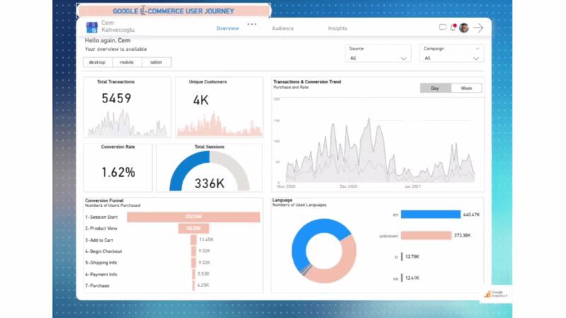

# Google E-commerce User Journey Analytics 📊

This repository features an end-to-end business intelligence project that analyzes 3 months of Google Merchandise Store data (GA4). The project bridges the gap between raw BigQuery event data and actionable business insights through a high-fidelity Power BI dashboard.

## 🛠️ Data Infrastructure & ETL (BigQuery + SQL)

The project utilizes the [BigQuery Public Dataset](https://console.cloud.google.com/bigquery?p=bigquery-public-data&d=ga4_obfuscated_sample_ecommerce&t=events_20210131&page=table&pli=1&project=orbital-stage-422807-n6&ws=!1m5!1m4!4m3!1sbigquery-public-data!2sga4_obfuscated_sample_ecommerce!3sevents_20210131). Instead of using standard connectors, I developed a custom SQL query to flatten nested JSON structures and optimize the ETL process for the e-commerce funnel.

* **Event Flattening:** Extracted specific keys from nested `event_params` (e.g., revenue, page_location) using `UNNEST` and `COALESCE`.
* **Funnel Filtering:** Optimized the dataset to include only essential user journey milestones: `session_start`, `view_item`, `add_to_cart`, `begin_checkout`, and `purchase`.
* **Data Refinement:** Standardized operating systems, device categories, and traffic sources for seamless visualization.

## 📁 Project Structure

* **[Power BI Dashboard (PBIX)](Data/e-commerce.pbix)**: Main project file containing the full UI and data model.
* **[Cleaned Dataset](https://github.com/CemK-PM/BigQuery-E-Commerce-Project/blob/main/Data/Cleaned%20Data%20from%20PowerBI.xlsx)**: Processed data exported as **Cleaned Data from Power BI**.
* **[SQL Extraction Script](Data/BigQuery%20SQL.psql)**: The optimized BigQuery Standard SQL query.
* **[Project Documentation (PDF)](Assets/BigQuery%20E-commerce%20PDF.pdf)**: A static report export of the dashboard pages.

## 🖥️ Dashboard Dynamic Demo
 

*A preview of the interactive dashboard featuring a custom Cartesian dot-grid background and dynamic navigation.*

## 🧠 Technical Highlights: DAX Logic

To ensure deep analytical capabilities, I developed several custom DAX measures that drive the dashboard's core insights:

1. **E-commerce Conversion Funnel Logic:** Sequentially calculates user progression from initial session to final purchase to identify specific drop-off points across the 7-step journey.
2. **Dynamic Performance Indicators (KPIs):** Real-time calculation of total transactions, unique customer counts, and average conversion rates relative to user-selected filters.
3. **User Engagement Trends:** Utilizes advanced time-intelligence functions to visualize daily and weekly fluctuations in user volume and purchasing behavior.

> 🔗 **Detailed Code Implementation:** You can explore the full implementation of all DAX measures (Conversion Rates, KPIs, and Filtering Logic) in the [Full DAX Documentation](https://github.com/CemK-PM/BigQuery-E-Commerce-Project/blob/main/DAX).

## 🚀 Key Insights

* **Funnel Leakage:** Analysis reveals a significant 70% drop-off rate after the 'Product View' stage, indicating potential friction in the 'Add to Cart' process.
* **Channel Efficiency:** Organic and Direct traffic channels remain the primary drivers, accounting for 75% of total revenue.
* **Mobile Conversion Gap:** Mobile conversion rates are 15% lower than desktop, highlighting an opportunity for mobile UI/UX optimization.
